# 🌐 Form Deployment on AWS EC2 using Nginx

This project demonstrates how to deploy a web form on an Amazon EC2 instance using **Nginx** as the web server. It includes step-by-step setup and configuration.

---

## 📁 Project Structure

```bash

project-root/
├── assets/
│ ├── ec2-setup.png
├── home_page.html
├── login
├── README.md
```

---

# 🚀 Deployment Steps

### 1. Launch EC2 Instance

- Go to AWS Console → EC2 → Launch a new instance
- Choose Amazon Linux 2 AMI
- Allow HTTP (port 80) in the security group

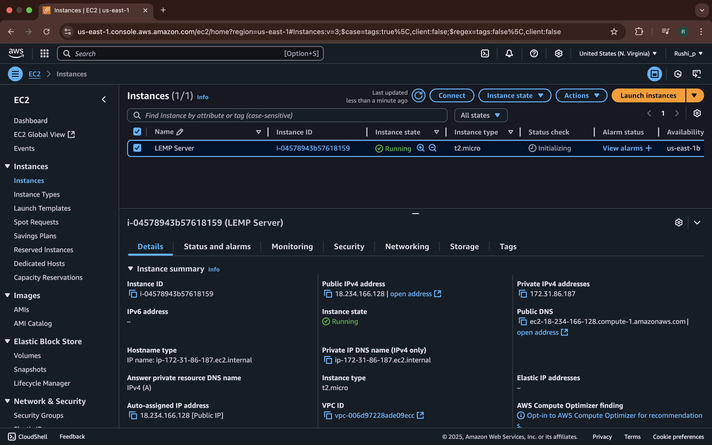

---

### 2. Connect via SSH

```bash
ssh -i your-key.pem ec2-user@your-ec2-public-ip
```

---

### 3. Install Nginx on EC2

```bash
sudo yum update -y
sudo amazon-linux-extras enable nginx1
sudo yum install -y nginx
sudo systemctl start nginx
sudo systemctl enable nginx
```

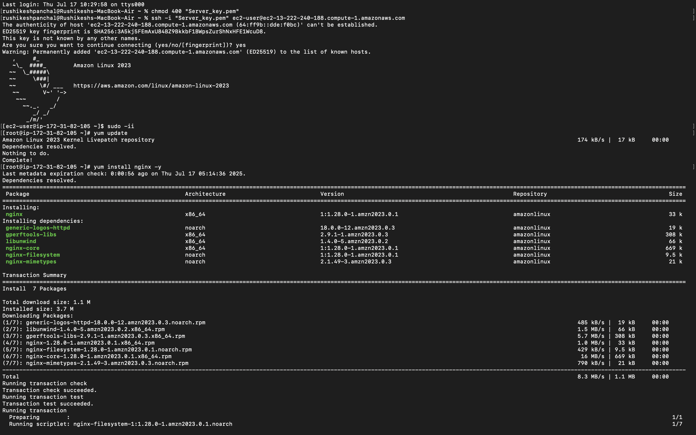

---

### 4. Deploy Your Form

Copy your index.html and any supporting files (CSS, JS) to the Nginx root:

```bash
sudo cp index.html /usr/share/nginx/html/
sudo cp style.css /usr/share/nginx/html/
```

---

### 5. Add Port number 90

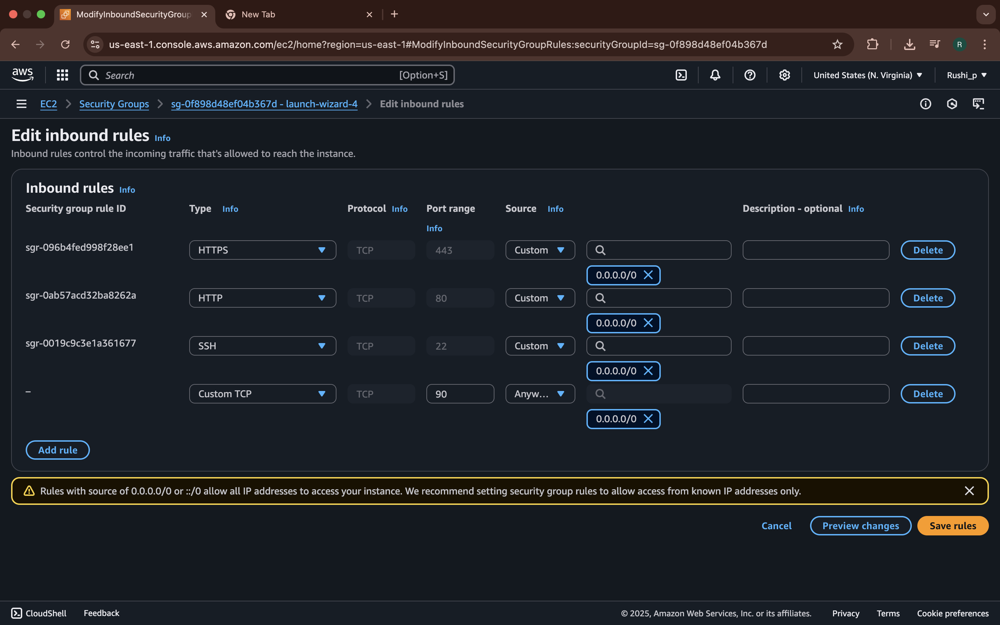

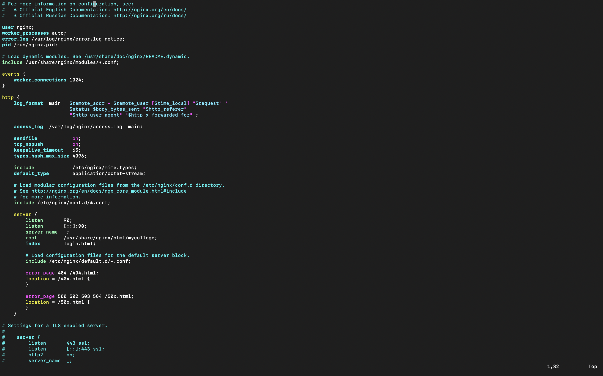

### 5. View Your Form

Open your browser and go to:
<http://13.222.240.188:90>

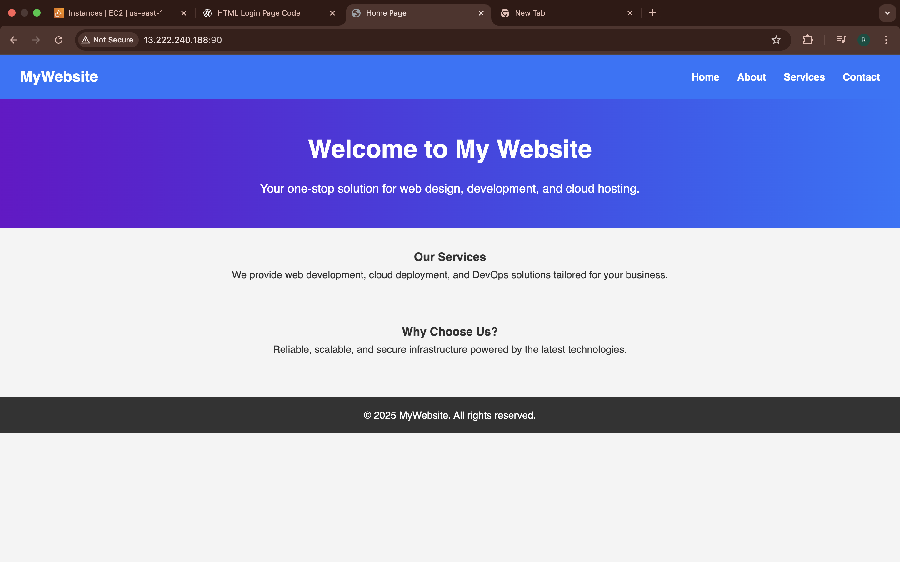
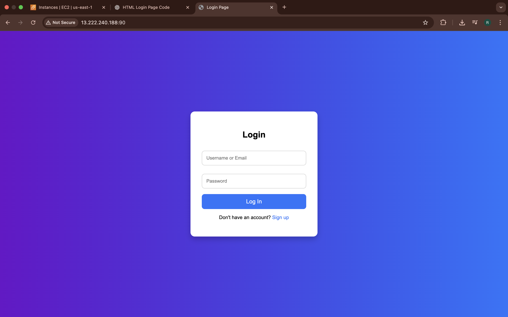

---

### 6. Author

Rushikesh Panchal
LinkedIn | GitHub

---

### 📝 How to Make It Work

1. Save all images (`ec2-setup.png`, etc.) in a folder called `assets/` inside your project directory.
2. Save the above content as `README.md` in the root of your project.
3. When you push this to GitHub or another repo, the images will show up if they are in the correct relative path.

---

Let me know if you'd like to include form source code, live demo links, or auto-deployment steps (e.g., with a script or CI/CD).

### All Steps

#### 1


#### 2

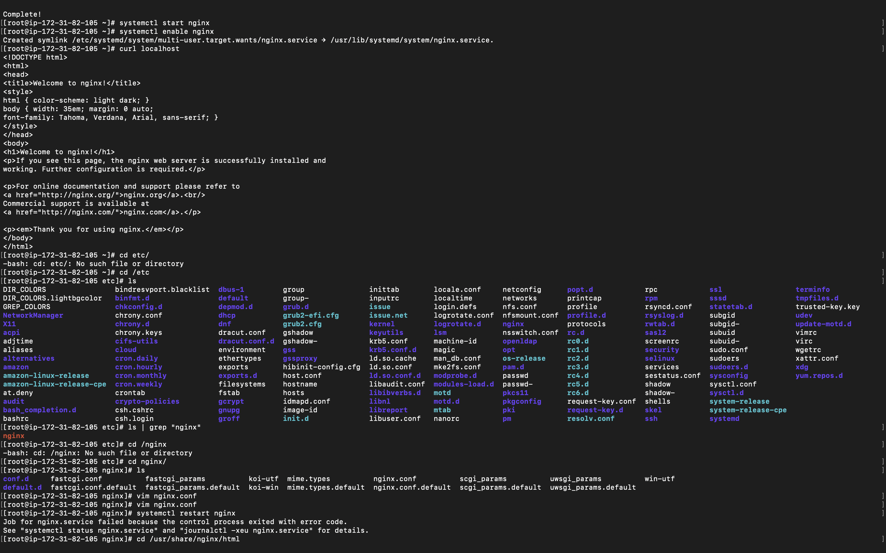

#### 3

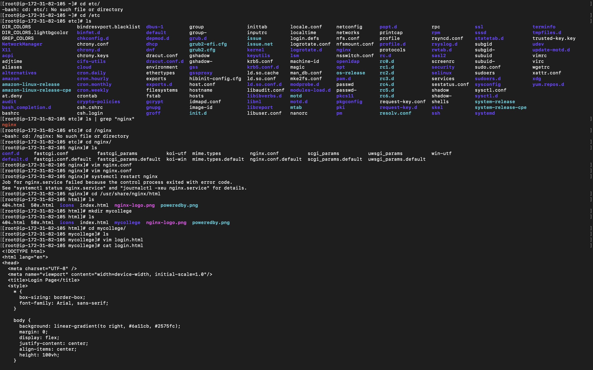

#### 4

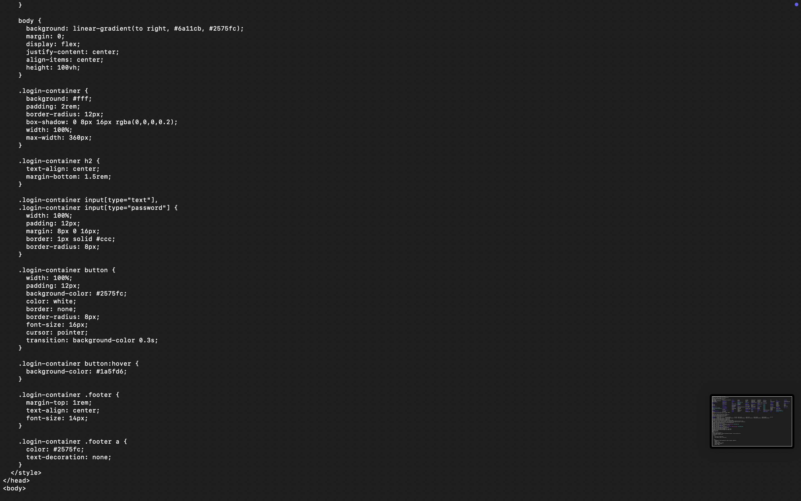

#### 5

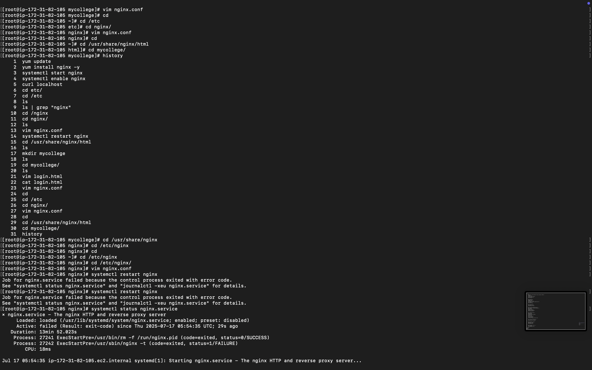

#### 6

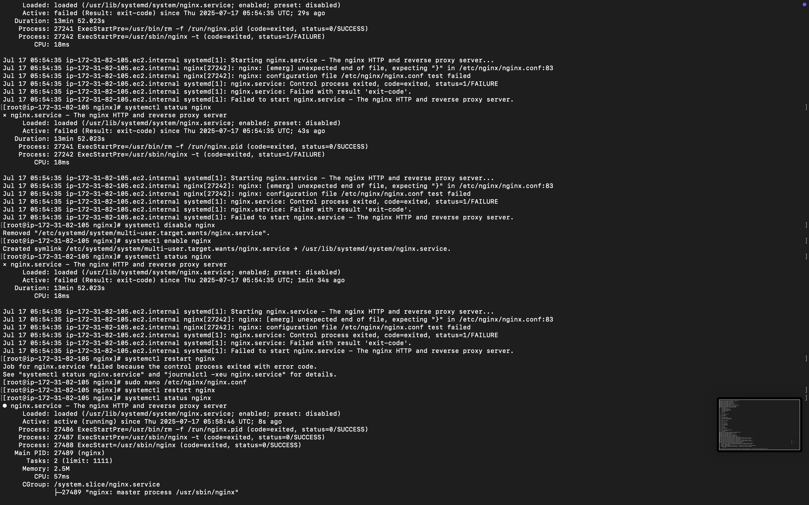

#### 7

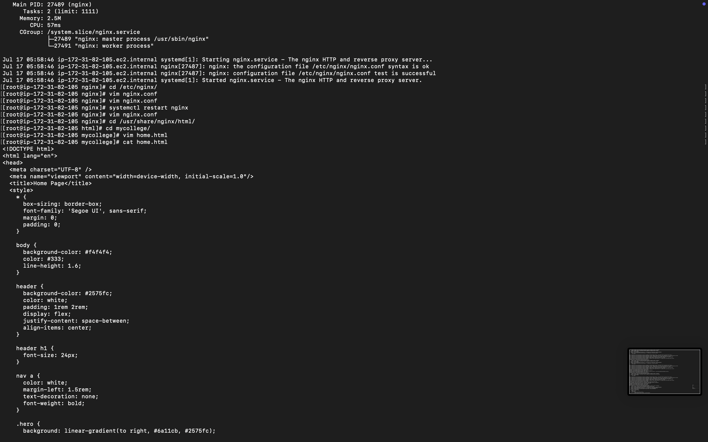

#### 8

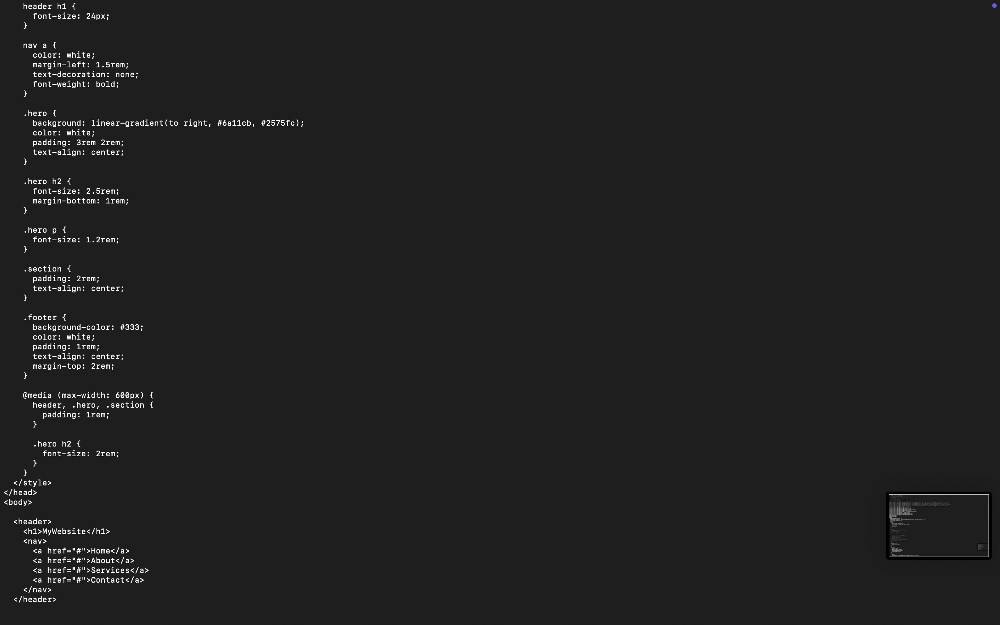

#### 9

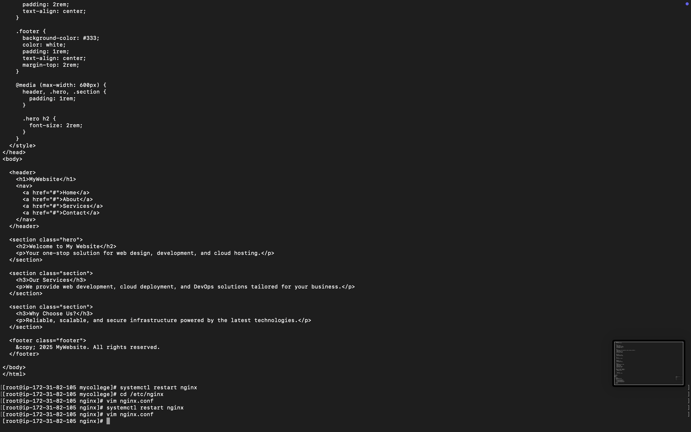

#### 10

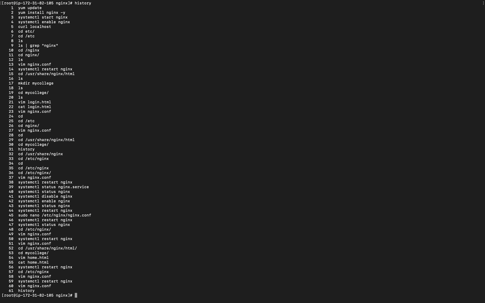
